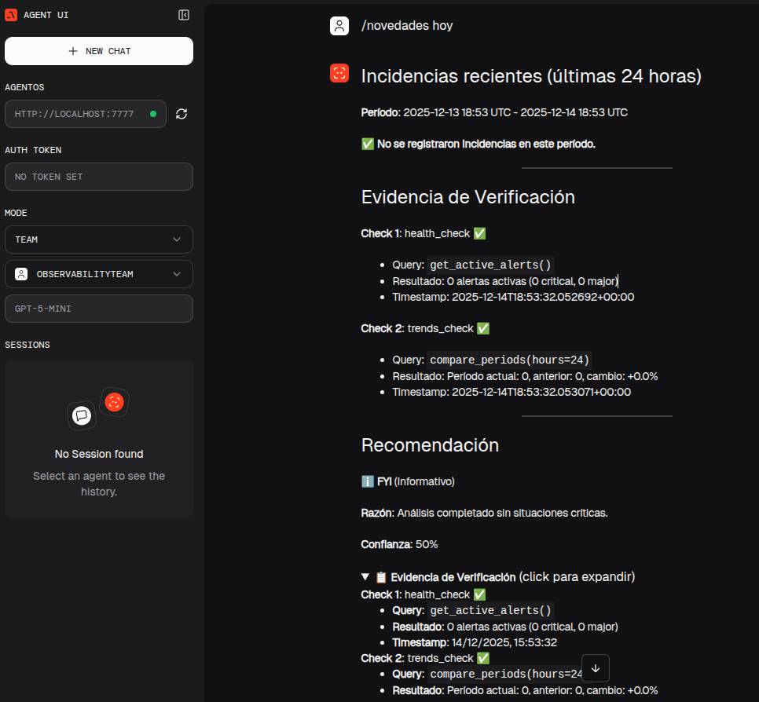

# Documentación del Sistema de Observabilidad

## 📚 Índice de Documentación

### Context Engineering

1. **[Context Engineering Guide](CONTEXT_ENGINEERING.md)** 📖
   - Documentación completa sobre context engineering
   - Arquitectura del sistema (ObservabilityTeam, WatchdogAgent, TriageAgent, ReportAgent)
   - Parámetros detallados por agente
   - Cómo modificar el contexto
   - Best practices (Do's y Don'ts)
   - Ejemplos prácticos de modificaciones
   - Testing y validación
   - Referencias a Agno docs

2. **[Quick Reference](CONTEXT_QUICK_REFERENCE.md)** ⚡
   - Guía rápida para modificaciones comunes
   - Tabla resumen de parámetros
   - Comandos de testing
   - Common pitfalls
   - Checklist de calidad

3. **[Implementation Summary](IMPLEMENTATION_SUMMARY.md)** ✅
   - Resumen de implementación (2025-12-10)
   - Resultados alcanzados
   - Mejoras observables (antes/después)
   - Archivos modificados/creados
   - Archivos modificados/creados
   - Próximos pasos

4. **[Configuration Guide](CONFIGURATION.md)** ⚙️
   - Guía completa de configuración (YAML + Env Vars)
   - Estructura de config.yaml
   - Variables de entorno disponibles


### Quick Commands



4. **[Quick Commands Guide](QUICK_COMMANDS.md)** 🚀
   - Comandos rápidos de observabilidad
   - 5 comandos principales (incidents, health, post-deploy, trends, digest)
   - **Slash Commands**: Ejecutá comandos desde el chat (`/novedades`, `/salud`, etc.)
   - **Sistema de Recomendaciones**: NOTIFY (accionable) vs FYI (informativo)
   - **Verificación con Evidencia**: Checks automáticos adicionales
   - **Deduplicación**: TTL de 30 min para evitar notificaciones repetitivas
   - Modo híbrido (query directa vs análisis IA)
   - Uso vía API REST y QueryAgent
   - Ejemplos prácticos y casos de uso

5. **[Slash Commands Visual Guide](SLASH_COMMANDS_VISUAL_GUIDE.md)** 📸
   - Guía visual con capturas de pantalla
   - Anatomía completa de un slash command
   - Interpretación de recomendaciones
   - Tips de UX y elementos de interfaz
   - Flujo de ejecución detallado

---

## 🚀 Quick Start

### Para Desarrolladores Nuevos

1. Lee [Context Engineering Guide](CONTEXT_ENGINEERING.md) completo
2. Consulta [Quick Reference](CONTEXT_QUICK_REFERENCE.md) para cambios rápidos
3. Revisa [Implementation Summary](IMPLEMENTATION_SUMMARY.md) para entender el estado actual

### Para Modificaciones Rápidas

1. Consulta [Quick Reference](CONTEXT_QUICK_REFERENCE.md)
2. Modifica el archivo correspondiente
3. Testa con:
   ```bash
   curl -X POST http://localhost:7777/api/alerts \
     -H "Content-Type: application/json" \
     -d @test-alert.json
   ```

---

## 📋 Estructura del Sistema

```
ObservabilityTeam (Líder)
├── WatchdogAgent: Clasificación de severidad y deduplicación
├── TriageAgent: Correlación de métricas/logs/traces
└── ReportAgent: Generación de reportes en markdown
```

**Flujo de Análisis:**
1. **Alerta de Grafana** → Webhook → `/api/alerts`
2. **WatchdogAgent**: Clasifica (critical/major/minor/info) y verifica duplicados
3. **TriageAgent**: Correlaciona Prometheus + Loki + Tempo
4. **ReportAgent**: Genera reporte con Alert Summary, Timeline, Evidence, Root Cause, Next Steps

---

## 🛠️ Archivos Clave

### Agentes
- `agent/agents/watchdog_agent.py` - Clasificación y deduplicación
- `agent/agents/triage_agent.py` - Correlación de observabilidad
- `agent/agents/report_agent.py` - Generación de reportes
- `agent/agents/observability_team.py` - Coordinación del equipo

### Configuración
- `config.yaml` - Archivo principal de configuración
- `agent/config.py` - Lógica de carga (YAML + Env vars)
- `.env` - Variables de entorno (API keys, URLs)

### Tools
- `agent/tools/alert_tools.py` - Clasificación, deduplicación, enriquecimiento
- `agent/tools/observability_tools.py` - Wrappers de Prometheus/Loki/Tempo

### API
- `api/alerts_api.py` - Endpoint de webhook `/api/alerts`
- `main.py` - Entry point de AgentOS

---

## 📊 Parámetros de Context Engineering

| Agente | description | instructions | expected_output | additional_context | dependencies | few-shot |
|--------|------------|--------------|-----------------|-------------------|--------------|----------|
| **WatchdogAgent** | ✅ | 6 pasos | JSON | Severidades, ventana | - | - |
| **TriageAgent** | ✅ | 6 pasos | JSON | - | ✅ Servicios, thresholds | - |
| **ReportAgent** | ✅ | 6 reglas | Markdown | - | - | ✅ 2 ejemplos |
| **ObservabilityTeam** | ✅ | 6 fases | JSON | ✅ SLOs, runbooks, deps | - | - |

---

## 🔍 Testing

```bash
# 1. Iniciar servidor
cd /home/pablo/source/agente-admin
source venv/bin/activate
uvicorn main:app --host 0.0.0.0 --port 7777

# 2. Enviar alerta de prueba
curl -X POST http://localhost:7777/api/alerts \
  -H "Content-Type: application/json" \
  -d @test-alert.json

# 3. Ver reporte generado
cat test-alert-report.md
```

---

## 🔗 Enlaces Útiles

### Agno Framework
- [Agno Docs](https://docs.agno.com/)
- [Context Engineering - Teams](https://docs.agno.com/basics/context/team/overview)
- [Agent Reference](https://docs.agno.com/reference/agents/agent)
- [Team Reference](https://docs.agno.com/reference/teams/team)

### Observabilidad
- [Prometheus Query Language (PromQL)](https://prometheus.io/docs/prometheus/latest/querying/basics/)
- [Loki Query Language (LogQL)](https://grafana.com/docs/loki/latest/logql/)
- [Tempo Tracing](https://grafana.com/docs/tempo/latest/)

---

## ✍️ Contribuir

Para añadir o modificar documentación:

1. Edita el archivo correspondiente en `docs/`
2. Actualiza este índice si añades nuevos documentos
3. Añade entrada en el changelog de [IMPLEMENTATION_SUMMARY.md](IMPLEMENTATION_SUMMARY.md)
4. Valida que los links funcionen

---

## 📅 Última Actualización

**Fecha**: 2025-12-14  
**Versión**: v1.1  
**Estado**: Context Engineering + Slash Commands Completos ✅

### Cambios Recientes (v1.1)
- ✨ **Slash Commands**: Ejecutá Quick Commands directamente desde el chat
- 🔔 **Sistema de Recomendaciones**: NOTIFY vs FYI con confianza
- 📋 **Verificación con Evidencia**: Checks automáticos adicionales
- 🔄 **Deduplicación**: TTL de 30 min para evitar spam
- 📸 **Guía Visual**: Documentación con capturas de pantalla

